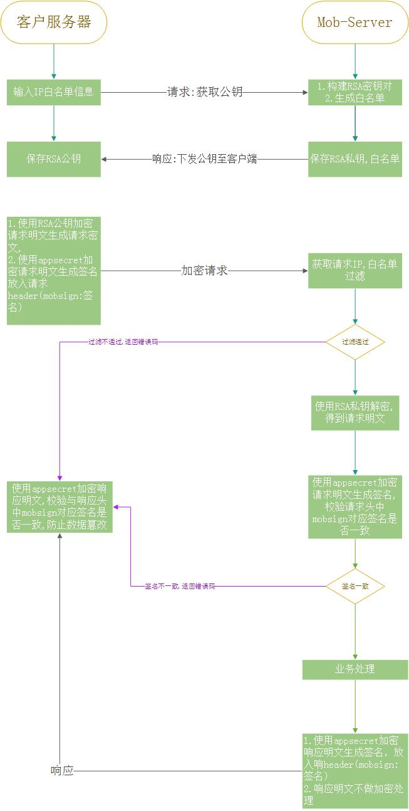
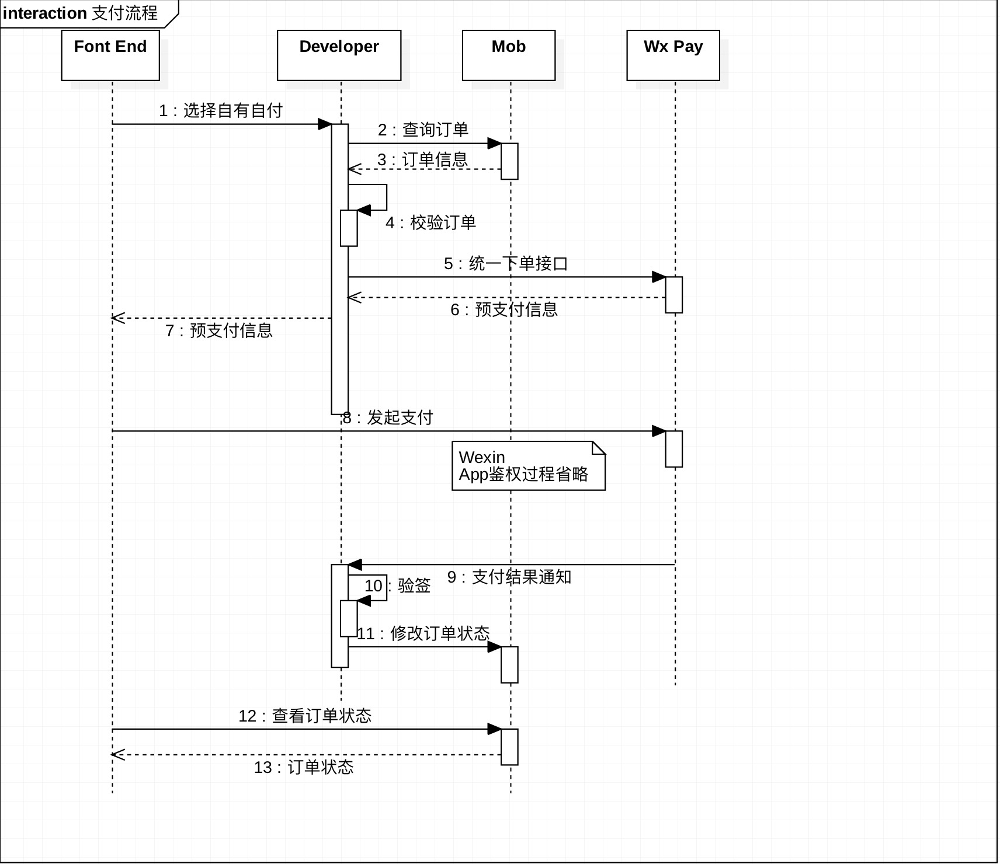

# 电商SDK自有支付demo

> 本示例，模拟开发接入自有支付系统。如果使用MobPay则无需查看本示例

本示例采用微信支付作为开发者自有自付方式

1. 微信支付
    1. 统一下单
    2. 支付结果通知
    3. 申请退款
2. mob server
    1. 订单查询
    2. 支付状态变更
    3. 退款商品查询
    4. 退款进度变更

### 配置文件
微信支付相关配置在wx.properties中
```properties
#商户id
weixin.mchid=xxxx
#微信支付应用appid
weixin.appid=xxxx
#微信支付密钥
weixin.secret=xxx
# 微信支付证书路径
weixin.certPath=xxx
# 微信支付服务器
weixin.baseUrl=https://api.mch.weixin.qq.com/
# 微信支付结果通知url
weixin.notifyUrl=xxx
```

Mob相关配置在mob.properties中
```properties
# mob应用的appkey
mob.appKey=xxx
# mob应用秘钥
mob.appSecret=xxx
# mob app 对应公钥
mob.publicKey=xxxx
# mob 服务器url
mob.baseUrl=http://192.168.104.200:8000/
```

## 与Mob交互

### IP白名单
1. 开发者需要将自己的服务器ip配置到应用的ip白名单中

### Header
1. 请求头中必须包含当前应用的appkey
2. 请求头中必须包含当前参数的签名mobsign
3. Content-Type: application/json;charset=UTF-8
```java
    /**
    * @see com.mob.etrade.server.demo.MobServerClient#postForObject(java.lang.String, java.lang.Object, com.fasterxml.jackson.core.type.TypeReference) 
    */
    //2. 请求头中应有appkey
    httpPost.setHeader("appkey", appkey);

    //3. 请求参数签名
    httpPost.setHeader("mobsign", createSign(jsonNode));
```

### RSA加密
1. 开发者需要从开发者配置中获取公钥
2. 对数据进行加签操作之后需要使用公钥对数据进行加密
```java
/**
 * @see com.mob.etrade.server.demo.MobServerClient#postForObject(java.lang.String, java.lang.Object, com.fasterxml.jackson.core.type.TypeReference) 
 */
```

### Mob 签名介绍
1. 第一步，设所有发送或者接收到的数据为集合M，将集合M内非空参数值的参数按照参数名ASCII码从小到大排序（字典序），使用URL键值对的格式（即key1=value1&key2=value2…）拼接成字符串stringA
2. 在stringA最后拼接上appsecret得到stringSignTemp字符串，并对stringSignTemp进行MD5运算，再将得到的字符串所有字符转换为大写，得到sign值signValue。
```json
{
  "data": {
    "order": 123456,
    "orderPaid": 100
  },
  "appkey": "xxxx",
  "other": "other"
}
```
这样带有层次结构的json将得到这样的stringA
```json
appkey=xxxx&data={order:123456,orderPaid:100}&other=other&appsecret=xxxx
```

### 大致流程


### 关于退款
Mob商城提供退单查询接口。开发者可通过轮询该接口，获取退单列表。
示例中提供了一个页面用于展示退单列表，并人工完成退款。
```bash
localhost:8080/refund/wx/refundList.html
```
## 支付流程


## 人工退款流程


